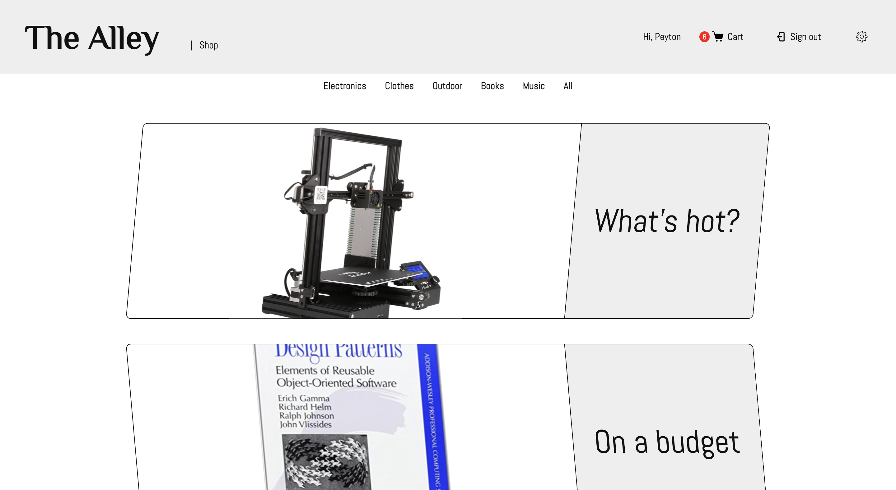
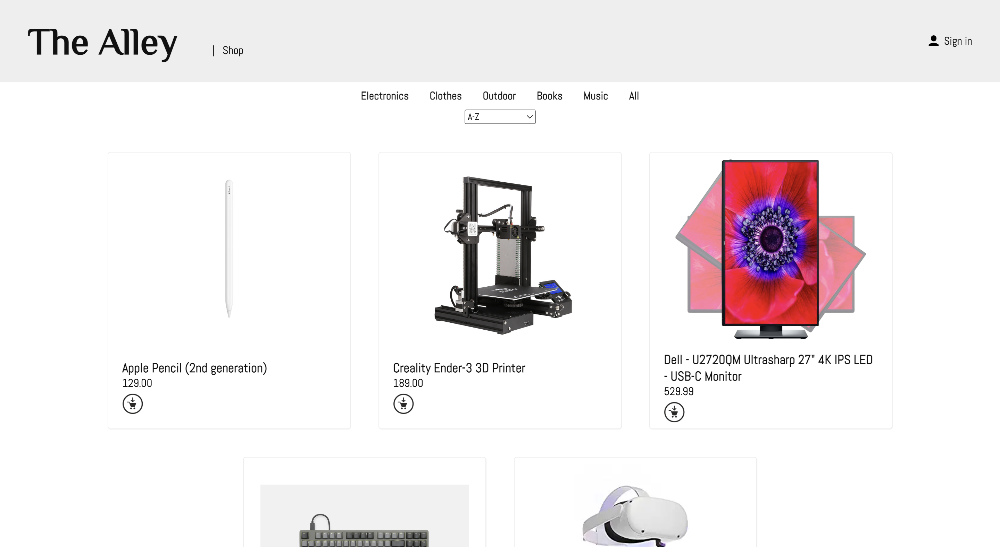
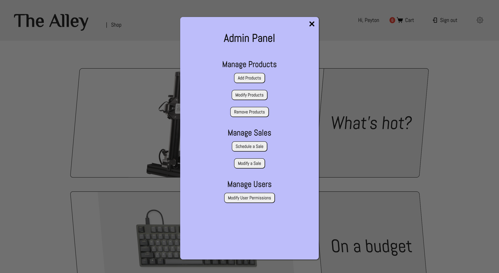
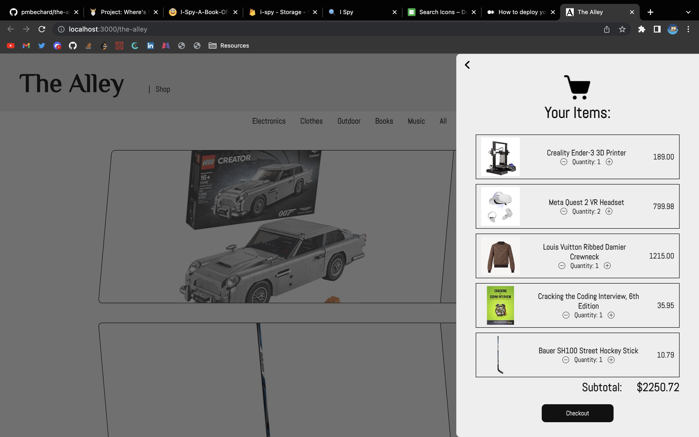

# The Alley

## A sample shop page made using React, TypeScript, and Firebase

Includes user authentication with sign-in persistence and cart item storage; an admin panel that allows authorized users to add, remove, and modify products, create sales promotions, and edit user permissions; and a dynamic cart and checkout page.

### [Live Version](https://pmbechard.github.io/the-alley/)

